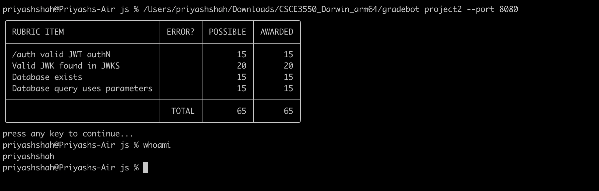

# JWT Authentication Server with SQLite Backed JWKS Storage

## Overview

This project extends a basic JWKS (JSON Web Key Set) server by integrating a **SQLite** database to securely manage private keys. The server is designed to issue JWT (JSON Web Token) tokens for authentication and manage public keys through RESTful APIs, ensuring **resilience** against SQL injection and maintaining **persistent key storage** even through server restarts.

## Features

-   **SQLite-backed key management** to persist RSA private keys.
-   **JWT generation and authentication** using securely stored keys.
-   **JWKS endpoint** to serve public keys for token verification.
-   **Middleware for HTTP method enforcement**, preventing misuse of API endpoints.
-   **Test suite** with **≃** 80% coverage, ensuring robust functionality.
-   **Error handling** for database connection issues and key retrieval failures.

## Table of Contents

- Requirements
- Installation
- Endpoints
- Key Functionality
- Testing
- Test Results
- ESlint Configuration
- TestClient (Gradebot)
-  Contributing

## Requirements

-   **Node.js** and npm installed
-   SQLite installed
-   Recommended editor: **Visual Studio Code**

## Installation

1.  Clone the repository:
    

    `git clone https://github.com/pr1yash/Project-2-Extending-the-JWKS-server.git
cd Project-2-Extending-the-JWKS-server` 
    
2.  Install dependencies:
    
    
    `npm install` 
3. Install Mocha and c8 (if not already installed):
	
	`npm install mocha c8 --save-dev`  
4.  Run the server:
    
   
    `node server.js` 
    

The server will start on `http://localhost:8080`.

## Endpoints

### **GET /ready**

-   **Description:** Checks if the server is ready.
-   **Response:** `200 OK`

### **POST /auth**

-   **Description:** Generates a JWT using a valid (or expired) private key from the database.
-   **Request Parameters:**
    -   `expired` (optional): If present, the JWT will be signed with an expired key.
-   **Response:**
    -   On success: `{ "token": "<JWT>" }`
    -   On failure: `500 Internal Server Error`

### **GET /.well-known/jwks.json**

-   **Description:** Retrieves public keys in JWKS format for token verification.
-   **Response:** `{ "keys": [ { "kty": "...", "n": "...", "e": "..." } ] }`

## Key Functionality

1.  **RSA Key Generation and Storage:**
    
    -   Keys are generated on server startup.
    -   A valid key (expires in 1 hour) and an expired key are stored in the SQLite database.
    -   PEM format is used for key storage to handle SQLite's limited datatype support.
2.  **JWT Generation and Signing:**
    
    -   A valid private key is used to sign JWTs unless the `expired` query parameter is specified.
    -   JWTs contain a sample payload with `iat` (issued at) and `exp` (expiry) fields.
3.  **Public Key Retrieval (JWKS):**
    
    -   Valid public keys are served through the `/jwks.json` endpoint in JWKS format.
4.  **Middleware:**
    
    -   Enforces POST method on `/auth` and GET method on `/jwks.json`.

## Testing
The project uses **Mocha** for test execution and **c8** for generating code coverage reports to verify the performance and reliability of the JWT authentication server.

#### Installation

Make sure the required tools are installed by running:

`npm install mocha c8 --save-dev`

1.  Run the test suite:
    
    `npm test` 
    
2.  Generate test coverage:

    `npm run coverage` 
    

### Test Output Example:

`priyashshah@Priyashs-MacBook-Air js % npm run coverage

> project2_javascript@1.0.0 coverage
> NODE_ENV=test c8 mocha 'test/**/*.mjs'

Connected to the SQLite database at /Users/priyashshah/Desktop/js/totally_not_my_privateKeys.db

  JWT Authentication Server
    GET /ready
      ✔ should return HTTP 200 when the server is ready
    POST /auth
      ✔ should return a valid JWT token when authentication is successful
      ✔ should handle key generation failure
    GET /.well-known/jwks.json
      ✔ should return a list of public keys in JWK format
      ✔ should handle errors when fetching keys from the database
    Enforce HTTP method restrictions
      ✔ should disallow GET requests on /auth
      ✔ should disallow POST requests on /.well-known/jwks.json
    Database and Error Handling
      ✔ should handle database connection errors on startup

  8 passing (65ms)

-----------|---------|----------|---------|---------|----------------------------------------------------
File       | % Stmts | % Branch | % Funcs | % Lines | Uncovered Line #s                                  
-----------|---------|----------|---------|---------|----------------------------------------------------
All files  |   78.19 |    70.83 |      50 |   78.19 |                                                    
 server.js |   78.19 |    70.83 |      50 |   78.19 | 17,33-41,47-49,51-53,72-74,103-104,118-119,126-131 
-----------|---------|----------|---------|---------|----------------------------------------------------`
## ESLint Configuration

The project follows **ESLint** best practices with the configuration file located in `eslintrc.config.mjs`. The setup ensures consistent code style and quality checks.

To lint the code:

`npm run lint` 

## Test-Client (GradeBot)

Below is a screenshot of the test client running against my server: 

## Contributing
Contributions are welcome! Please open an issue or submit a pull request.

